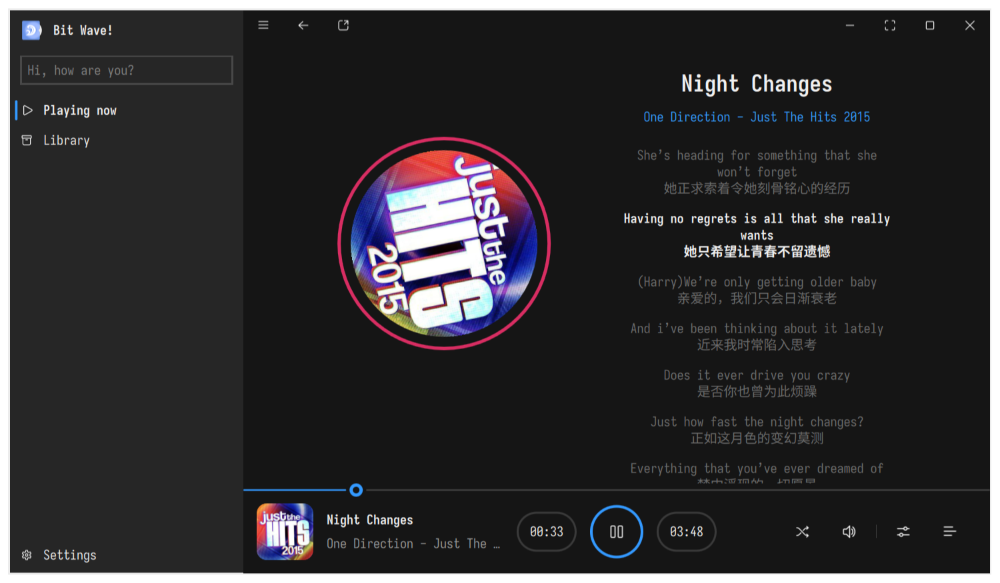
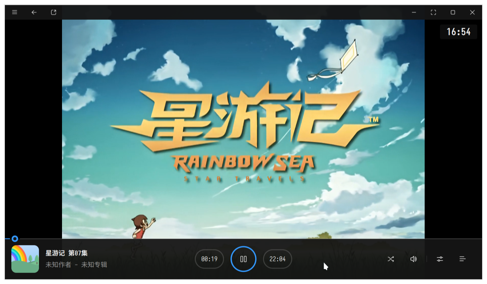
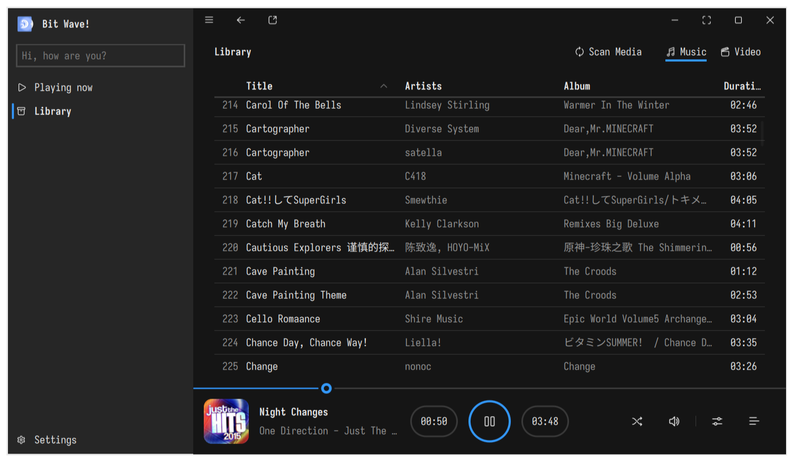

# 

A simple media player that wrappers MPV.

## Features

- [x] Play local media files
- [ ] Play online media files
- [x] Media metadata
- [x] Music lyrics
- [ ] Library and playlist management
- [ ] Various fine-tuning and control of the player

## Additional (Maybe)

- [ ] MacOS / Windows build
- [ ] Fetch data from musicbrainz / discogs whatsoever.
- [ ] cdparanoia cdrip

## Preview

## LICENSE

Mozilla Public License 2.0

default media cover illustrations by [V-vika](https://www.iconfont.cn/illustrations/detail?cid=43981)

Icons made by [Fluent UI System Icons](https://github.com/microsoft/fluentui-system-icons)

App logo and other arts made by myself, and you can use them freely under the same MPL 2.0.
